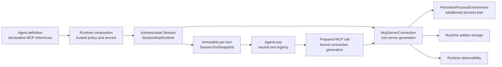

# Session-owned MCP runtime architecture

This document is the normative design for MCP in Sylvander. It explains what
the subsystem owns, why it is Session-scoped, how a server process is confined,
and which invariants implementation and tests must preserve. MCP is a special
Runtime capability source. It is not an Agent extension API and it does not
change the ordinary tool contract.

## Scope and official evidence

The wire target is MCP 2025-11-25. Protocol fields and state transitions come
from the official lifecycle, transports, tools, resources, cancellation, and
authorization specifications.

The official [`modelcontextprotocol/rust-sdk`](https://github.com/modelcontextprotocol/rust-sdk)
was downloaded locally and pinned at
`a50a73fda2cd55f87633a280b430f539b1094234`. Reviewed paths include:

- `crates/rmcp/src/model/tool.rs` for required JSON Schema objects and the rule
  that annotations are untrusted hints;
- `crates/rmcp/src/service/client.rs` for full cursor traversal and client
  request lifecycle;
- `crates/rmcp/src/transport/child_process.rs` for stdio ownership, close,
  bounded graceful shutdown, and kill fallback;
- `crates/rmcp/tests/` and `examples/clients/` for notification, cancellation,
  structured-result, pagination, and real child-process fixtures.

Product architecture was compared with these pinned local sources:

- OpenAI Codex `16fbfe557446a1af94da81e1144029ccc1311ad0`, especially
  `codex-rs/core/src/session/mcp.rs` and `codex-rs/config/src/mcp_types.rs`:
  MCP runtime state belongs to a Session and each server selects an explicit
  execution environment;
- Anthropic Sandbox Runtime
  `7f1792ab3db3ab9210e0a8fa74826dd59c63a5b4`, especially `README.md` and
  `src/sandbox/`: local MCP servers are a stated sandbox use case and effective
  isolation requires both filesystem and network enforcement;
- Claude Code public repository
  `681a8be245e7759a405e276b16ae69ea6b75076f`: public release evidence covers
  MCP lifecycle hardening, environment scrubbing, transport failures, and
  sandbox fail-if-unavailable behavior. Proprietary implementation details are
  not protocol evidence.

## Final ownership decision

An MCP server can retain state, observe a workspace, hold credentials, and
execute calls for many turns. Sharing that process at Agent revision scope can
cross authenticated Session, user, or workspace boundaries. Therefore the
final ownership chain is:



- Agent definitions declare desired servers and tool policy. They contain no
  resolved secrets, process handles, transport clients, or sandbox adapters.
- Runtime composition resolves trusted configuration, secrets, execution
  environments, and admission policy.
- An authenticated Session owns `SessionMcpRuntime`. Its binding includes
  tenant, user, Agent, Session, workspace target, workspace root identity, and
  the effective policy revision.
- Each live server connection owns exactly one transport generation and one
  sandboxed process tree or remote authenticated transport.
- Agent receives a provider-neutral, immutable tool snapshot for one turn. It
  never starts, reconnects, inspects, or shuts down an MCP server.

The Agent process does not run inside every tool sandbox. Agent uses a
Runtime-owned execution service; the MCP child and its descendants run inside
the selected persistent sandbox.

## Module boundary

The target Runtime layout is:

```text
sylvander-runtime/src/mcp/
  mod.rs                 subsystem facade and stable internal vocabulary
  config.rs              validated transport, exposure, and environment policy
  session.rs             SessionMcpRuntime lifecycle and immutable snapshots
  connection.rs          generation, request routing, reconnect, health
  protocol.rs            MCP 2025-11-25 typed wire conversion
  transport/
    stdio.rs              framed stdio transport only
    streamable_http.rs    later remote transport; no stdio fallback
  environment.rs         PersistentProcessEnvironment port
  tool_adapter.rs        remote Tool -> neutral RegisteredTool adapter
  result.rs              bounded model result and governed artifact routing
  observability.rs       content-free metrics, traces, and health facts
```

`sylvander-agent` continues to depend only on `sylvander-llm-core` among
first-party LLM crates. MCP protocol types remain entirely in Runtime. The
Agent tool facade sees only neutral schema, exposure, preparation, execution,
and output types.

## Session lifecycle

`SessionMcpRuntime` uses an explicit state machine:

1. **Configured** — validated declarations exist; no secret or process exists.
2. **Starting** — Runtime resolves secrets and asks the selected environment to
   create a confined process before any MCP bytes are exchanged.
3. **Initializing** — client sends `initialize`, validates the exact negotiated
   protocol, and sends `notifications/initialized`.
4. **Discovering** — tools/resources are paged, bounded, fully validated, and
   assembled off to the side.
5. **Ready** — one immutable catalog revision is atomically published.
6. **Degraded** — current generation cannot serve new calls. An uncertain
   in-flight call is never replayed.
7. **Draining** — new calls are rejected; active requests receive bounded time
   to finish or protocol cancellation.
8. **Stopped** — stdin/transport closes, the child gets a bounded graceful-exit
   window, the full process tree is terminated if necessary, and cleanup is
   awaited.

Session detach, expiry, policy replacement, workspace replacement, user
revocation, and Runtime shutdown all enter the same awaited drain path.
Kill-on-drop remains only the last orphan-prevention boundary.

## Per-turn tool snapshot

The base ordinary-tool registry belongs to the Agent revision. MCP tools do
not. At turn admission Runtime asks the Session MCP runtime for a
`SessionToolSnapshot` and merges it into that turn's effective registry.

The snapshot contains only:

- namespaced public name and original remote name;
- description and valid provider-neutral input/output JSON Schema;
- exposure/search metadata selected by Runtime policy;
- authorization class and server identity;
- an executor bound to the exact Session, server, and connection generation.

Catalog changes become visible only on the next model iteration or turn. A
prepared call cannot silently route to a replacement generation. If its bound
generation is gone, execution returns a typed unavailable result and the model
may rediscover before retrying. This preserves definition/executor identity
across preparation, authorization, audit, and execution.

Tool annotations from an MCP server never grant read-only status, parallelism,
destructive permission, filesystem access, network access, or approval. They
may inform display text after sanitization. Trusted Runtime policy owns every
authorization decision.

Deferred exposure and `tool_search` remain generic Agent registry mechanisms.
Session MCP policy may choose immediate or deferred exposure, but transport
discovery and model exposure are separate decisions.

## Persistent process environment

Stdio requires a long-lived bidirectional process, so the one-shot
`WorkspaceExecutor` is not reused or weakened. Runtime owns a distinct
`PersistentProcessEnvironment` port with operations equivalent to:

- `spawn(spec, authority) -> PersistentProcess`;
- bounded stdin writes and stdout frame reads;
- separately bounded stderr observation;
- cancellation and graceful input close;
- process-tree wait/terminate;
- isolation truth and violation retrieval;
- deterministic asynchronous cleanup.

The authority object is Runtime-created and fixes the Session identity,
workspace binding, read/write policy, network policy, resource ceilings,
environment allowlist, executable identity, and admission deadline. Model or
project content cannot select or widen any of them.

Production stdio fails closed unless the selected adapter proves all required
properties:

- filesystem access is restricted to explicit read/write roots;
- network is denied by default and any allowlist is OS/proxy enforced;
- memory, CPU, PID/process-tree, output, and wall-clock limits are enforced;
- ambient environment is cleared and only reviewed values are injected;
- descendants remain inside the same boundary;
- cancellation, violations, exit, and cleanup are observable.

The first production adapter is a persistent OCI environment. A native
sandbox adapter remains planned. Direct host spawning is test-only. Missing Seatbelt,
bubblewrap, Windows restricted-token/WFP support, OCI daemon, or configured
sandbox runtime is an unavailable environment, never permission to run on the
host.

## Protocol and transport rules

- The client advertises only implemented capabilities.
- `inputSchema` is required and must be an object. No schema is invented.
- Every cursor collection is bounded by page count, item count, and nonrepeating
  cursor validation, then atomically published.
- Requests have startup-, discovery-, call-, and drain-specific deadlines.
- Timeout or dropped request emits `notifications/cancelled` when the transport
  is still writable.
- A reconnect creates a new generation and rediscovers the complete catalog.
- An uncertain tool call is never replayed after transport failure.
- Stdio stdout accepts only bounded JSON-RPC frames; stderr is never parsed as
  protocol data.
- Streamable HTTP will be a separate transport with exact protocol-version
  headers, origin checks, authenticated secret leases, and no downgrade to
  deprecated HTTP+SSE or stdio.

## Results, storage, and observability

MCP protocol errors and model-visible tool failures remain distinct from
Runtime-fatal failures. Complete successful or model-visible-error results are
retained through the governed Runtime artifact service when configured.
Models and clients receive a Unicode-safe bounded preview and opaque locator;
binary payloads never enter the transcript as base64 dumps.

Artifact identity binds tenant, user, Agent, Session, turn, server, remote
operation, call identity, and admission time. Failure to retain the only copy
must preserve it inline rather than replace it with a broken locator.

Runtime observability is fixed, not extension-controlled. It records
content-free lifecycle duration, server generation, request kind, outcome,
timeout/cancellation/reconnect counts, sandbox adapter and violations, catalog
revision/counts, and artifact-retention outcome. Logs and health never contain
secret values, arguments, raw results, full executable paths, or workspace
paths.

## Failure semantics

| Failure | Required behavior |
|---|---|
| Unknown/unavailable environment | Session server remains unavailable; do not spawn locally. |
| Sandbox cannot enforce policy | Fail before process creation. |
| Initialization/version mismatch | Terminate generation; publish no tools. |
| Invalid or oversized catalog page | Keep prior complete revision; degrade generation. |
| Tool timeout/cancellation | Send protocol cancellation; never replay. |
| Transport loss during call | Outcome is uncertain; reconnect only for later calls. |
| Session/workspace/policy changes | Await drain and create a newly bound runtime. |
| Artifact retention fails | Preserve the complete inline result. |
| Graceful shutdown expires | Terminate the complete process tree and await cleanup. |

## Migration and acceptance order

Implementation follows ownership, not feature popularity:

1. introduce the `mcp/` module vocabulary and persistent environment port;
2. move MCP runtime construction from Agent revision composition to
   authenticated Session attach/detach;
3. inject immutable Session tool snapshots at turn admission;
4. implement fail-closed persistent OCI/native stdio execution;
5. complete awaited drain, generation-bound calls, storage, health, and traces;
6. add deferred exposure and autonomous search policy;
7. add Streamable HTTP and OAuth secret leases.

Acceptance requires real-process tests for two simultaneous Sessions using the
same Agent definition but different users/workspaces; neither catalog, server
state, environment, result, artifact, cancellation, nor health state may cross
the boundary. Tests must also cover model families routed through Anthropic,
OpenAI Responses, OpenAI Chat Completions, and DashScope because wire adapters
must preserve the same neutral tool snapshot.

## Current implementation status

Runtime now owns a neutral persistent-process port and an OCI adapter that
enforces a read-only root, exact workspace bind, denied network, dropped
capabilities, no-new-privileges, and memory/CPU/PID ceilings. `mcp_stdio`
consumes that port; its direct host process path is compiled only for protocol
tests. Authenticated Session attach resolves secret references, checks the
named environment's isolation truth, constructs read/write workspace
authority, starts and initializes one client per Session, and Session detach
awaits graceful close or complete process-tree termination.

Discovered catalogs are now composed with the Agent-revision registry through
Agent's provider-neutral Session-extension boundary. Route collisions and
gateway drift fail closed. Runtime installs the combined registry and exact
audited invocation gateway under one Session identity; Agent freezes that pair
once at turn admission. A prepared MCP executor records its connection
generation and refuses to route through a replacement generation.

Native sandbox, fixed MCP-specific observability events, and Streamable HTTP
remain pending. OCI stdio MCP now has the required Session ownership,
generation-bound per-turn exposure, and process isolation needed for production
composition.
